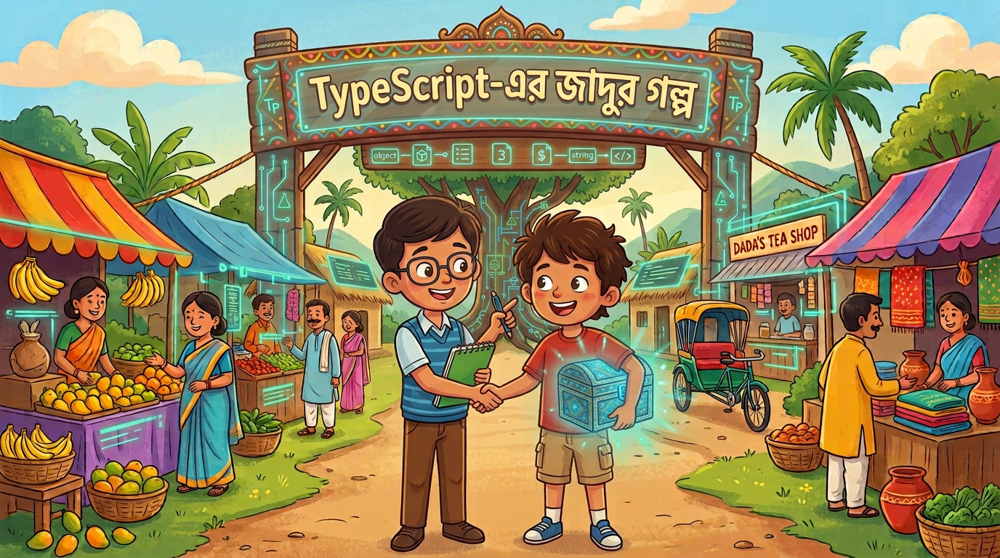

# TypeScript- এর জাদুর গল্প

## ভুমিকা
একটা গ্রামে ছিল দুই বন্ধুঃ টাইপি আর স্ক্রিপ্টু । টাইপি ছিল  খুবই সাবধানী, আর স্ক্রিপ্টু ছিল একদম ফুর্তিবাজ। স্ক্রিপ্টু যেকোনো কাজ করে ফেলে, কিন্তু টাইপি সবসময় বলে, "নিয়ম মেনে কাজ করো, নাহলে পরে সমস্যা হবে!"


একদিন দুই বন্ধু মিলে একটা বিশাল শহরের বাজার বানানোর স্বপ্ন দেখলো। এই বাজারে হাজারো দোকান, হাজারো পণ্য। কিন্তু বাজার বানাতে গিয়ে তারা বুঝলো — এত বড় জিনিস বানাতে হলে কিছু জাদুর নিয়ম লাগবে। নাহলে সব এলোমেলো হয়ে যাবে!

তখন টাইপি আর স্ক্রিপ্টু দুইটা জাদুর বই খুঁজে পেলো। বই দুটোর নাম — **"Generics"** আর **"OOP-এর চার স্তম্ভ"** । 

# অধ্যায় ১: Generics — "সবজায়গায় কাজ করে এমন জাদুর বাক্স" 
## সমস্যাটা কী ছিল? 
বাজারে দুই ধরনের পণ্য আসে — ফল আর সবজি। টাইপি আর স্ক্রিপ্টু প্রতিটা পণ্যের জন্য আলাদা আলাদা "সংরক্ষণ বাক্স" বানাতে লাগলো।


```
// ফলের জন্য বাক্স
function fruitBox(item: string) {
  return { item };
}

// সবজির জন্য আরেকটা বাক্স
function veggieBox(item: number) {
  return { item };
}

```
স্ক্রিপ্টু বলল, "ভাই, এত বাক্স কেন? একটাই বাক্স বানাও, সব পণ্য ওখানে রাখা যাবে!"

টাইপি বলল, "কিন্তু একটাই বাক্স বানালে তো আমি জানবো না ভিতরে কী আছে! ফল আছে না সবজি আছে?"

# জাদুর সমাধান: Generics
তখন টাইপি বই খুলে একটা জাদুর মন্ত্র শিখলো — <T> (পড়া যায় "টাইপ টি")। এই মন্ত্র দিয়ে বানানো বাক্স **যেকোনো জিনিস রাখতে পারে**, কিন্তু **কী রাখছে সেটা মনে রাখে!**

```
// জাদুর বাক্স — যেকোনো জিনিস রাখা যায়, টাইপও ঠিক থাকে
function magicBox<T>(item: T) {
  return { item };
}

const fruitBox = magicBox<string>("আম");   // ভিতরে string আছে
const veggieBox = magicBox<number>(5);      // ভিতরে number আছে
```
# এটা কীভাবে জাদু করে?
<T> হলো একটা খালি ঘর — তুমি যখনই ব্যবহার করবে, তখনই বলে দেবে "এই ঘরে কী রাখবে"।
- ফল রাখলে → magicBox<string> → টাইপি জানে string এসেছে
- সবজি রাখলে → magicBox<number> → টাইপি জানে number এসেছে

**একই বাক্স, কিন্তু টাইপ ঠিক থাকে! স্ক্রিপ্টু খুশি, টাইপিও খুশি।** 

# বড় বাজারে এর মূল্য
এখন বাজারে হাজারটা পণ্য — ফল, সবজি, মাছ, মাংস, কাপড়...
**Generics ছাড়া:** প্রতিটা পণ্যের জন্য আলাদা বাক্স বানাতে হতো (হাজারটা কোড!)
**Generics দিয়ে:** একটা বাক্স, যেকোনো পণ্য, টাইপও ঠিক!

```
// একটাই ফাংশন, হাজারো কাজ
function findItem<T>(list: T[], target: T): boolean {
  return list.includes(target);
}

findItem(["আম","কাঁঠাল","লিচু"], "আম");       // string অ্যারে
findItem([1, 2, 3, 4], 3);                     // number অ্যারে
findItem([{name:"মাছ"},{name:"মাংস"}], {name:"মাছ"}); // object অ্যারে

```
## বড় বাজারে যে যত রকমের পণ্য আসবে, এই একটা জাদুর বাক্সই সব সামলাবে — আর টাইপও কখনো ভুল হবে না!
