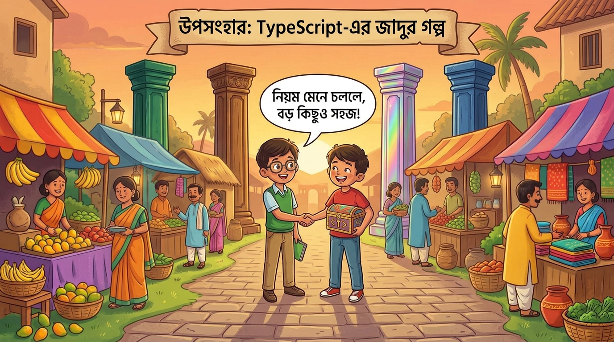

# অধ্যায় ২: OOP-এর চার স্তম্ভ — "বাজারের চার খুঁটি"
বাজার বড় হতে হতে টাইপি আর স্ক্রিপ্টু দেখলো, সব এলোমেলো হয়ে যাচ্ছে! তখন তারা বইয়ের দ্বিতীয় অধ্যায় খুললো — সেখানে লেখা ছিল OOP-এর চার স্তম্ভ। এগুলো হলো বাজারের চারটা খুঁটি, যা দিয়ে বাজার টিকে থাকে।


## স্তম্ভ ১: Encapsulation (এনক্যাপসুলেশন) — "দোকানের গোপন ঘর"
প্রতিটা দোকানের ভিতরে একটা গোপন ঘর থাকে। দোকানদার চাল, ডাল, টাকা — সব গোপন ঘরে রাখে। গ্রাহক শুধু কাউন্টারে এসে বলে "আমাকে ১ কেজি চাল দিন", দোকানদার নিজেই ঘর থেকে এনে দেয়।
```
class Shop {
  private money = 5000;   //  গোপন ঘর — বাইরে থেকে দেখা যায় না

  buy(kg: number) {       // কাউন্টার — বাইরের সাথে যোগাযোগের দরজা
    this.money += kg * 60;
  }

  getBalance() {
    return this.money;
  }
}

```
### কেন দরকার? 
বড় বাজারে হাজারো দোকান। যদি সবাই সব দোকানের টাকা দেখতে/বদলাতে পারত, তাহলে সব এলোমেলো হয়ে যেত! Encapsulation নিশ্চিত করে — প্রতিটা দোকান নিজের জিনিস নিজে সামলায়, বাইরে থেকে কেউ উল্টোপাল্টা করতে পারে না।

## স্তম্ভ ২: Inheritance (ইনহেরিটেন্স) — "দাদার রেসিপি ছেলের উত্তরাধিকার"
বাজারে সব দোকানদারের একটা **মূল রেসিপি বই আছে** — কীভাবে হিসাব করতে হয়, কীভাবে পণ্য সাজাতে হয়। প্রতিটা নতুন দোকানদার **দাদার বইটা পায় (inherits)**, তারপর নিজের মতো যোগ করে।
```
class BasicShop {
  open() { console.log("দোকান খুললো"); }
  close() { console.log("দোকান বন্ধ"); }
}

class FishShop extends BasicShop {   // দাদার বই পেল
  sellFish() { console.log("মাছ বিক্রি"); }
}

class VeggieShop extends BasicShop { // দাদার বই পেল
  sellVeggie() { console.log("সবজি বিক্রি"); }
}
```
### কেন দরকার?
 বড় বাজারে ১০০টা দোকান। প্রতিটা দোকানের জন্য আলাদা করে open() আর close() লিখতে গেলে ২০০টা কোড! কিন্তু Inheritance দিয়ে — **একবার লিখলাম, সবাই পেল, প্রত্যেকে নিজের মতো যোগ করলো।** কম কোড, কম ঝামেলা!

## স্তম্ভ ৩: Polymorphism (পলিমরফিজম) — "একই কমান্ড, ভিন্ন ভিন্ন কাজ"
এখন বাজারে সব দোকানদারকে একই কথা বলা হয়: **"বিক্রি করো!"**
    -মাছের দোকানদার → মাছ বিক্রি করে
    -সবজির দোকানদার → সবজি বিক্রি করে
    -কাপড়ের দোকানদার → কাপড় বিক্রি করে

**একই কমান্ড, কিন্তু প্রত্যেকে নিজের মতো কাজ করে!** এটাই Polymorphism।   
```
class Shop {
  sell() { console.log("কিছু বিক্রি করলো"); }
}

class FishShop extends Shop {
  sell() { console.log("মাছ বিক্রি করলো "); }   // নিজের মতো
}

class VeggieShop extends Shop {
  sell() { console.log("সবজি বিক্রি করলো "); }   // নিজের মতো
}

// বাজারের সব দোকানকে একইভাবে চালানো যায়
const shops = [new FishShop(), new VeggieShop()];
shops.forEach(shop => shop.sell());  // একই কমান্ড!
```
### কেন দরকার? 
বড় বাজারে ১০০টা দোকান। যদি প্রতিটা দোকানের জন্য আলাদা আলাদা কমান্ড মনে রাখতে হতো, তুমি পাগল হয়ে যেতে! Polymorphism দিয়ে — একই কমান্ড, সব দোকানে কাজ করে। নতুন দোকান এলে নতুন কোড লিখতে হয় না!

## স্তম্ভ ৪: Abstraction (অ্যাবস্ট্রাকশন) — "শুধু নিয়ম, বিশদ নয়"
বাজারের প্রতিটা দোকানের একটা **নিয়মপত্র** আছে — "প্রতিটা দোকানে sell() নামের কাজ থাকতেই হবে।" কিন্তু কীভাবে বিক্রি করবে, সেটা প্রতিটা দোকান নিজে ঠিক করে।
```
abstract class Shop {
  abstract sell(): void;  //  নিয়ম: sell() থাকতেই হবে
  open() { console.log("দোকান খুললো"); }  // সাধারণ জিনিস সবাই পাবে
}

class FishShop extends Shop {
  sell() { console.log("মাছ বিক্রি "); }  // নিজের মতো বানালো
}
```
### কেন দরকার? 
বড় বাজারে নতুন দোকানদার এলে, তাকে শুধু বলো "sell() বানাও" — বাকিটা সে নিজে বুঝে নেয়। Abstraction নিশ্চিত করে সবাই একই নিয়ম মেনে চলে, কিন্তু নিজের মতো করে।

# উপসংহার: চার খুঁটি মিলেই দাঁড়ায় বাজার
|স্তম্ভ	|গল্পে কী ছিল|	কী করে|
|---|---|---|
|Encapsulation|	গোপন ঘর	জিনিস লুকায়,| নিয়ন্ত্রিত দরজা দেয়|
|Inheritance|	দাদার রেসিপি|	কম কোডে কোড ভাগ করে|
|Polymorphism|	এক কমান্ড, ভিন্ন কাজ|	একইভাবে সবাইকে চালায়|
|Abstraction|	নিয়মপত্র|	নিয়ম দেয়, বিশদ বাদ দেয়|

আর **Generics** হলো সেই জাদুর বাক্স — যা যেকোনো জিনিস ধরে, কিন্তু টাইপ ভুল হতে দেয় না।
# শেষ কথা
টাইপি আর স্ক্রিপ্টু এই জাদুর নিয়মগুলো মেনে বাজার বানালো। বাজার এত সুন্দর হলো যে, সারা দেশের মানুষ আসতে লাগলো! আর সবচেয়ে মজার কথা — নতুন দোকান এলে, নতুন পণ্য এলে, বাজারটা আর কখনো এলোমেলো হলো না। কারণ জাদুর নিয়মগুলো ছিল।


TypeScript-এ প্রোগ্রামিংও ঠিক এটাই — Generics আর OOP-এর চার স্তম্ভ মিলে বড় প্রজেক্টকে সুন্দর, পরিষ্কার আর সহজে পরিচালনাযোগ্য রাখে। প্রথমবার শিখলে জটিল লাগে, কিন্তু গল্পের মতো ভাবলে — সব সহজ!